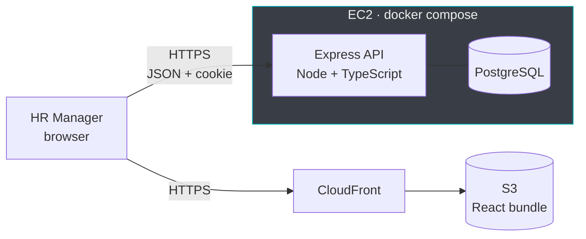
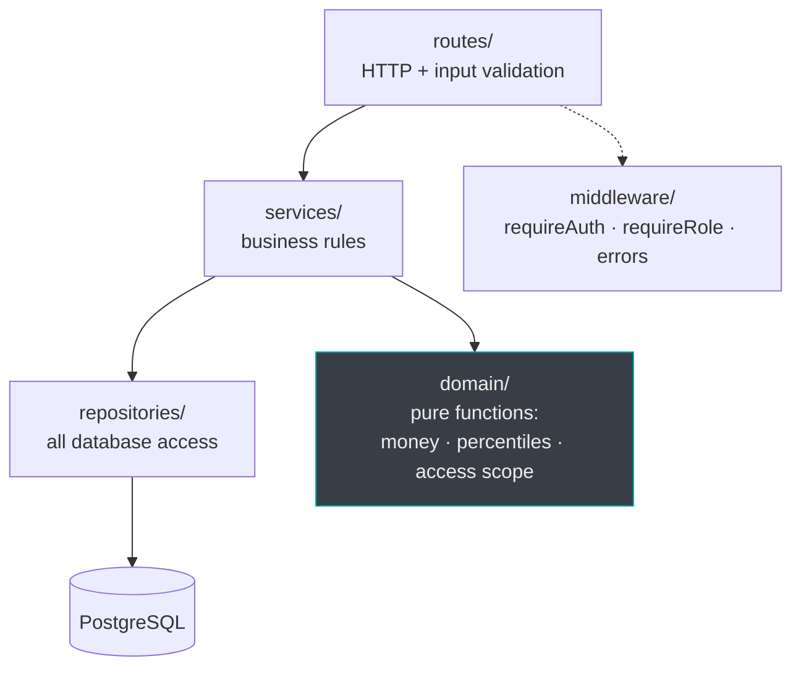
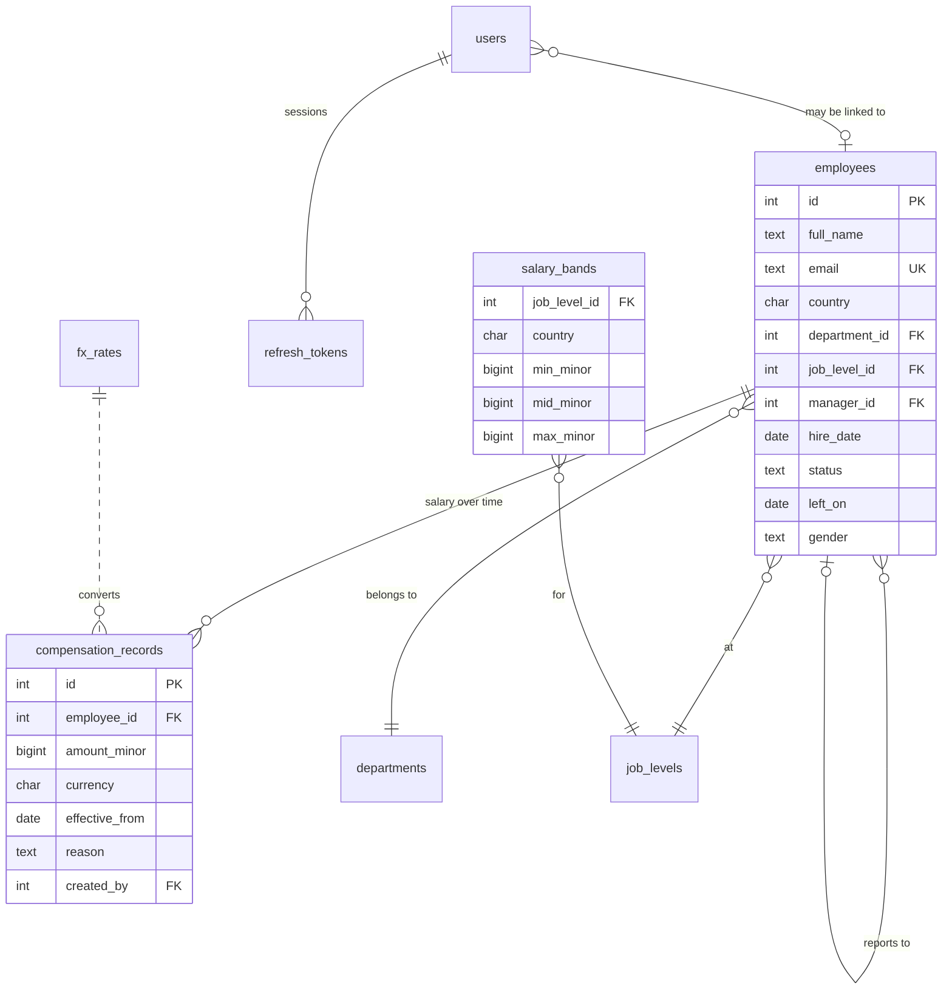

# Architecture

## Deployment

Two repos, deployed independently: `acme-salary-web` builds to static files on S3 behind CloudFront;
`acme-salary-api` runs as two containers on one EC2 instance. The API is stateless apart from the
database, so it can be replaced without migrating anything.

## Request path

Beside those five folders sits `shared/` — the error contract, the log format, the in-memory cache — used
by every layer and owned by none. Named `shared/` rather than `utils/` on purpose: "utils" means
_miscellaneous_, so it becomes the folder anything lands in and stops being possible to reason about. What
is left at the root is the composition root: `config.ts`, `container.ts`, `app.ts`, `server.ts`.

Rules that hold everywhere:

- **Nothing outside `repositories/` imports Drizzle.** Swapping query implementations touches one folder.
- **`domain/` has no database.** Money, percentile and access-scope logic are plain functions, so the
  trickiest code is also the cheapest to test.
- **Routes contain no business logic** — they validate input, call a service, and shape the response.
- **`accessScopeFor(user)` returns a filter, and every read path applies it** — list, detail, statistics,
  the needs-attention list, the CSV export, and the bulk-raise candidate query. The two write paths that
  operate over many people at once, import and bulk change, check the scope as well rather than relying on
  their route guard, so a role added later cannot write outside what it can see.
- **That rule is enforced by two tests that discover their own subjects**, rather than by everybody
  remembering. `tests/http/routeInventory.test.ts` reads the registered routes off the routers and fails
  until each is classified and its classification proved; `tests/repositories/queryScope.test.ts` reads the
  exported query builders and requires each to be either scoped — with the scope visible in the SQL it
  generates — or aggregate, in which case it may name nobody. A new endpoint or a new query fails the build
  until somebody has said which it is.
- **The definitions shared between queries live in one module each**, because two copies of a rule drift
  and the drift is invisible: `repositories/employeeFilters.ts` for who a query is about,
  `repositories/employeeRow.ts` for what an employee row is, `repositories/payBands.ts` for the band join
  and the "below band" predicate, and `domain/disclosure.ts` for the group size below which a median is
  withheld.

## Data model

`compensation_records` is append-only: a raise inserts a row, it does not update one. Current salary is
the most recent row whose `effective_from` has passed — one lateral lookup in SQL. `fx_rates` is a single
dated snapshot applied at read time, so a corrected rate never means rewriting salary rows.

`employees.left_on` is paired with `status` by a check constraint — both or neither. It is what makes a
historic payroll figure answerable: with only a status flag, a leaver either counts in every month they
were never there or in none of the months they were, and both make the total wrong.

`salary_bands` is unique on (job_level_id, country) and holds its figures in **that country's own
currency**, because fairness is judged against the local band and never against a converted amount.

## Where the load is

At 10,000 employees the database holds roughly 25,000 rows and a few megabytes. Measured, the statistics
run in 20–90 ms rather than single digits — see docs/performance.md, which has the numbers and the reason.
The constraint is still the payload to the browser, which is why the API pages results, aggregates in SQL,
and returns numbers rather than rows for the dashboard.

Two endpoints deliberately do not page. The CSV export reads in chunks of a thousand and streams, so
memory does not grow with headcount; a bulk-raise preview loads every candidate into Node, because the
rounding rule is a pure function the preview and the apply must share and expressing it in SQL as well
would be a second copy of the one thing that cannot be allowed to drift.
