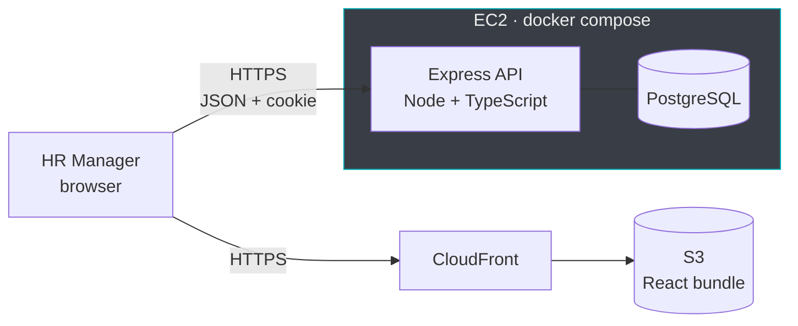
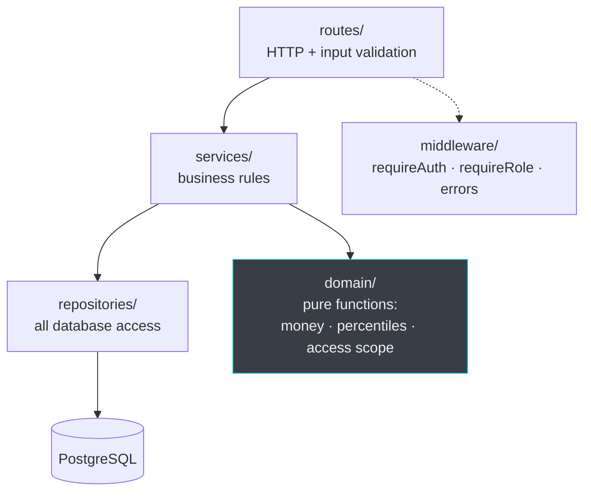

# Architecture

## Deployment

Two repos, deployed independently: `acme-salary-web` builds to static files on S3 behind CloudFront;
`acme-salary-api` runs as two containers on one EC2 instance. The API is stateless apart from the
database, so it can be replaced without migrating anything.

## Request path

Rules that hold everywhere:

- **Nothing outside `repositories/` imports Drizzle.** Swapping query implementations touches one folder.
- **`domain/` has no database.** Money, percentile and access-scope logic are plain functions, so the
  trickiest code is also the cheapest to test.
- **Routes contain no business logic** — they validate input, call a service, and shape the response.
- **`buildAccessScope(user)` returns a filter, and every read path applies it** — list, detail,
  statistics, bands, CSV export.

## Data model

`compensation_records` is append-only: a raise inserts a row, it does not update one. Current salary is
the most recent row whose `effective_from` has passed — one `DISTINCT ON` in SQL. `fx_rates` is a single
dated snapshot applied at read time, so a corrected rate never means rewriting salary rows.

## Where the load is

At 10,000 employees the database holds roughly 25,000 rows and a few megabytes; every statistic runs in
single-digit milliseconds. The constraint is the payload to the browser, which is why the API pages
results, aggregates in SQL, and returns numbers rather than rows for the dashboard.
